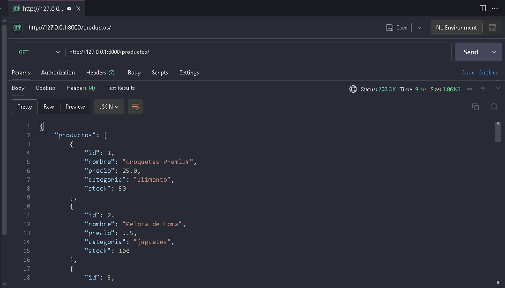

# 🐾 API de Productos para Tienda de Mascotas

Esta es una API REST construida con **FastAPI** para gestionar los productos de una tienda de mascotas. Permite crear, listar, actualizar (completa o parcialmente) y eliminar productos. También soporta filtros por nombre y categoría.

---

## 📸 Captura de la API



---

### 📦 Instalación de dependencias

```bash - powershell - command prompt
pip install fastapi uvicorn
